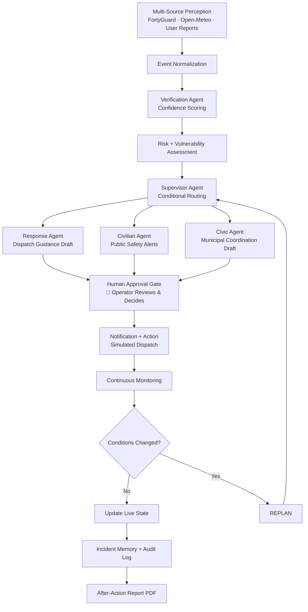

# 🌡️ HRES — Heat Response Emergency System

> **An AI-assisted, human-supervised heat-risk coordination platform that detects, verifies, prioritizes, and coordinates response to extreme heat incidents and cascading disasters.**

[](https://hres-dashboard.vercel.app/)
[](https://hres-backend.onrender.com/)


[](LICENSE)

---

## 🔥 The Problem

As urban temperatures escalate, severe heat can increase public-health risk, strain infrastructure, worsen fire conditions, disrupt transport, and trigger cascading emergencies. Emergency coordinators are often left making high-stakes decisions from incomplete, conflicting, and delayed data streams.

**HRES closes this gap** — turning raw environmental observations into verified, explainable, and auditable response proposals while keeping every critical decision under operator control.

---

## 💡 Why HRES?

| Traditional Emergency Management | HRES |
|---|---|
| Data viewed in silos | Multi-source perception pipeline |
| Manual cross-referencing | AI-assisted verification with confidence scores |
| Static response plans | Dynamic replanning on route/condition changes |
| One-size-fits-all alerts | Role-aware guidance (responders / civilians / civic) |
| Black-box alerts | Full reasoning + audit trail |
| Post-event paperwork | Automated After-Action Report |
| Human-only decisions | AI proposes → Human approves → System acts |

---

## ⚠️ Safety & Prototype Scope

> HRES is a hackathon prototype and decision-support platform — **not** an autonomous emergency-dispatch system.

- All risk thresholds, verification rules, and routing are deterministic and auditable.
- AI models generate explanations, action-plan drafts, chatbot responses, and reports.
- **High-impact actions require explicit operator approval. The system does not autonomously dispatch emergency services, place emergency calls, or issue public broadcasts.**
- Smoke/fire events are never confirmed from temperature data alone — independent corroborating evidence is always required by the Verification Agent.
- Live, cached, simulated, and unavailable data are explicitly labelled throughout the dashboard.

---

## 🏗️ System Architecture & Workflow



---

## ✨ Key Features

### 🤖 LangGraph Multi-Agent Workflow
A stateful, graph-based AI pipeline that coordinates the entire incident lifecycle:

- **Verification Agent** — Cross-references sensor data from multiple sources (FortyGuard, Open-Meteo, User Reports) using deterministic confidence scoring (source reliability × freshness × consensus × location match) before escalating any event.
- **Risk Assessment Node** — Calculates an explainable composite severity score: **LOW → MODERATE → HIGH → CRITICAL**.
- **Supervisor Agent** — Conditionally routes the workflow based on risk level and detected event types (fire, roadblock, heat-only), or terminates early for low-risk scenarios.
- **Response Agent** — Drafts responder guidance (ambulance, fire, campus security) with real facility locations and road route estimates.
- **Civilian Agent** — Produces calm, concise public safety alerts with cooling center guidance.
- **Civic Agent** — Coordinates municipal situation-report drafts and stakeholder notification proposals.
- **Continuous Monitoring & Replanning** — Monitors changing conditions and triggers the Supervisor to reassess and issue updated plans when the situation evolves.

### 🛑 Human-in-the-Loop Approval Gate
**AI proposes. Humans decide.**

Before any high-impact action is executed, the system pauses at a mandatory approval gate. An authorized operator reviews the AI's full reasoning chain and action proposal and can: **Approve** · **Modify** · **Reject** · **Escalate**

HRES does not autonomously contact emergency services. All external actions remain subject to explicit human authorization.

### 🗺️ Live Dynamic Routing
- Uses the **Overpass API** to discover nearby hospitals, fire stations, and cooling centers from OpenStreetMap data in real time.
- Uses the **OSRM API** to compute road route estimates with GeoJSON overlays drawn live on the Mapbox map.
- Routes are automatically re-requested and the plan is versioned when a road blockage event is detected.
- If routing APIs are unavailable (rate limits, timeouts), the system continues operating and clearly labels data as unavailable.

### 🌐 FortyGuard Heatmap Integration
- Submits hyper-local heatmap activity requests to the **FortyGuard API** based on the operator's monitored GPS location.
- Live temperature readings are ingested as observations and fed directly into the Verification Agent pipeline as high-reliability sensor data.

### 🤖 Context-Aware AI Chatbot
- Powered by Groq / Xkiro LLMs via LiteLLM with automatic provider fallback.
- Fully grounded in the current incident state — risk level, verified events, nearby facilities, and live weather.
- Operators can ask natural language questions like *"What is the current risk level?"* or *"Which hospital is closest to the incident?"* and receive data-grounded answers.

### 🔒 Role-Based Access Control (RBAC)
- **Google OAuth 2.0** for secure authentication.
- Designed for multi-agency use: **Central Government** · **Municipal Dispatcher** · **Field Responder** · **Civilian**
- JWT-secured session management throughout.

### 📊 Full Audit Timeline
- Every action is logged with a precise timestamp and event type to a persistent, tamper-evident audit trail.
- Covers AI agent decisions, operator approvals, sensor readings, simulation events, and system errors.

### 📄 AI-Generated After-Action Reports
- One-click PDF generation summarizing the full incident lifecycle — events, observations, decisions, routing, and audit log.
- Powered by `fpdf2`.

---

## 🛠️ Tech Stack

| Layer | Technology |
|---|---|
| **Frontend** | React 18, Vite, TypeScript, Mapbox GL JS |
| **Backend** | FastAPI, Python 3.11, Uvicorn |
| **AI Orchestration** | LangGraph, LiteLLM |
| **LLM Providers** | Groq, Xkiro |
| **Database** | PostgreSQL (Supabase) |
| **Auth** | Google OAuth 2.0, JWT |
| **Deployment** | Vercel (Frontend), Render (Backend) |
| **APIs** | FortyGuard Heatmap, Open-Meteo, Overpass, OSRM, Resend |
| **PDF Generation** | fpdf2 |

---

## 🚀 Getting Started (Local Development)

### Prerequisites
- Python 3.11+
- Node.js 18+
- A PostgreSQL database (Supabase free tier works great, or use `sqlite:///./data/hres.db` locally)

### 1. Clone the repository
```bash
git clone https://github.com/prakashkamath1926/HRES.git
cd HRES
```

### 2. Set up environment variables
Create a `.env` file in the root directory:
```env
FORTYGUARD_API_KEY=your_fortyguard_key
KIRO_API_KEY=your_xkiro_key
GROQ_API_KEY=your_groq_key
DATABASE_URL=postgresql://...
GOOGLE_CLIENT_ID=your_google_oauth_client_id
VITE_GOOGLE_CLIENT_ID=your_google_oauth_client_id
JWT_SECRET=your_random_jwt_secret
RESEND_API_KEY=your_resend_key
ALLOWED_ORIGINS=http://localhost:5173,http://localhost:3000
```

### 3. Start the Backend
```bash
pip install -r requirements.txt
python -m uvicorn backend.app.main:app --reload --port 8000
```

### 4. Start the Frontend
```bash
cd dashboard
npm install
npm run dev
```

Open `http://localhost:5173` in your browser.

---

## 🧪 Demo Simulation Flow

Use the **Simulation Console** in the dashboard to trigger a full end-to-end incident:

```
1. Heat Escalation   →  AI verifies temperature + FortyGuard data
         ↓
2. Smoke Report      →  AI cross-references with heat → Possible Fire event
         ↓
3. Road Blockage     →  Response Agent recalculates alternate emergency routes
         ↓
4. Human Approval    →  Operator reviews AI action proposal and approves
         ↓
5. Resolve           →  Download AI-generated After-Action Report PDF
```

| Scenario | What it triggers |
|---|---|
| **Heat Escalation** | FortyGuard + Open-Meteo heat observations → full verification + risk pipeline |
| **Smoke Report** | User smoke report → AI cross-references with heat → Possible Fire event |
| **Road Blockage** | Road block detected → Response Agent generates alternate route plan |
| **Normal Conditions** | Baseline low-risk scenario — Supervisor terminates early, no approval needed |

---

## 📁 Project Structure

```
HRES/
├── backend/
│   └── app/
│       ├── agents/          # LangGraph agent nodes
│       ├── api/             # FastAPI route handlers
│       ├── core/            # Schemas, state, config
│       ├── integrations/    # LLM, FortyGuard, email
│       ├── repositories/    # Database access layer
│       ├── services/        # Business logic (monitoring, routing, verification)
│       ├── simulations/     # Scenario JSON files
│       └── workflows/       # LangGraph supervisor graph + approval gate
├── dashboard/
│   └── src/
│       ├── components/      # React UI components
│       └── types/           # TypeScript type definitions
├── requirements.txt
├── vercel.json
└── README.md
```

---

## 🔐 Security Notes

- All API keys are stored server-side in environment variables only.
- The `.env` file is in `.gitignore` and is **never committed** to the repository.
- The React frontend contains **zero backend API keys**.

---

## 🏆 Built For

**FortyGuard Hackathon 2026**
- **Primary Track:** Track 1 — Resilient Cities & Infrastructure
- **Secondary Tracks:** Track 6 — Agentic AI · Track 4 — Government & Environment

---

## 👨‍💻 Team

**Prakash Kamath** — Full-stack development, AI/ML integration, system architecture

---

## 📄 License

This project is licensed under the MIT License.
